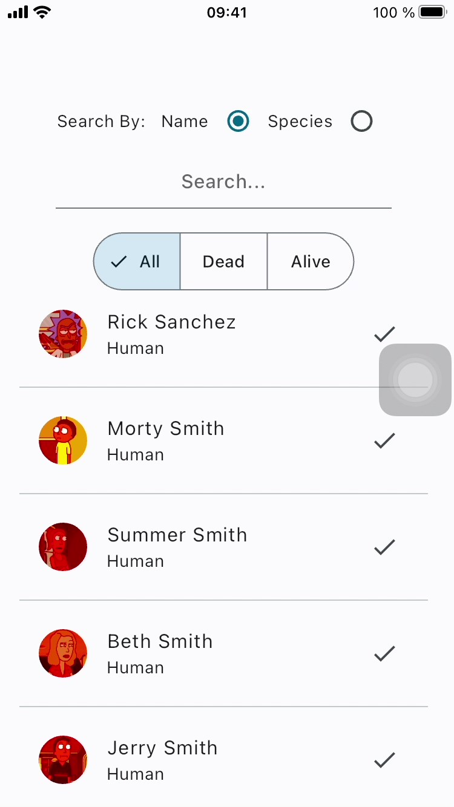
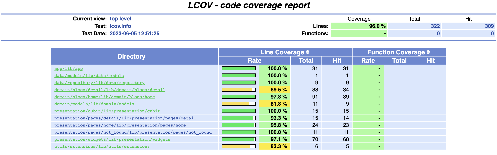

   
Bienvenido a JabuTest   
Este proyecto fue desarrollado como parte de un proceso pruebas técnicas.  
Le invitamos a visitar la Wiki para obtener documentación relacionada al proyecto haciendo <a href="https://github.com/fnoceda/jabu_test/wiki">click aqui</a>.  
Además puede descargar la app-debug más arriba seleccionando la opción de Releases o haciendo <a href="https://github.com/fnoceda/jabu_test/releases">click aqui</a>  

<table>
    <tr>
        <th>Android View</th>
        <th>iOS view</th>
    </tr>
    <tr>
        <td></td>
        <td></td>
    </tr>
    <tr>
        <th colspan="2">Coverage</th>
    </tr>
     <tr>
        <td colspan="2"></td>
    </tr>
</table>
